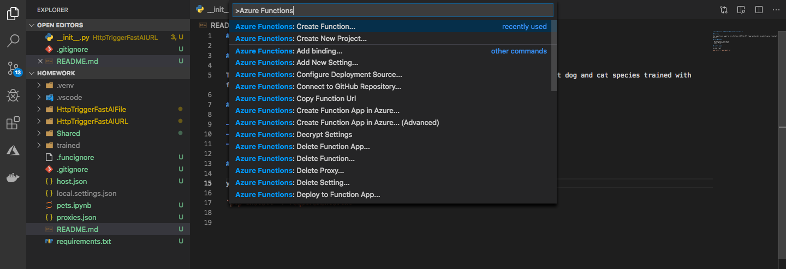
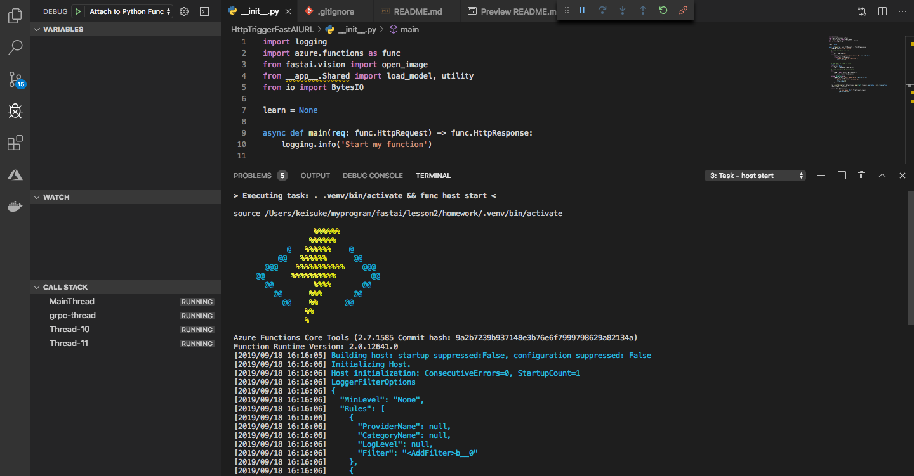

# Azure Functions v2.0 Python HTTP Trigger with fast.ai

## Overview

This respository is sample for Azure Functions v2.0 Python HTTP Trigger which predict dog and cat species trained with fast.ai. 

## Prerequisites 

- Microsoft Azure Subscription
- Jupyter Notebook environment
- python 3.6.8

## creat project and install module

you had better create virtual environment. [Visual Studio Code](https://azure.microsoft.com/en-us/products/visual-studio-code/) has an useful extension for Azure Functions.

install Python modules

`pip install -r requirements.txt`

## Run Notebook and Upload Trained Model

You can run Notebook whereever you want then upload trained model any storage services.
[Google Colaboratory](https://colab.research.google.com/notebooks/welcome.ipynb?hl=en) is good place to start.

## Download the model and place 

Download and unzip your model on document root. Fast.ai module `learn.load('stage-2')` checks `trained/models` directory.

## Debug Azure Function 

Press F5 (Windows) or fn + F5 (Mac) on [Visual Studio Code](https://azure.microsoft.com/en-us/products/visual-studio-code/) will start debug.
For more information, see [Run and test your App locally](https://code.visualstudio.com/tutorials/functions-extension/run-app)

Then use [Postman](https://www.getpostman.com/) or `curl` to test your Functions.

`curl -X POST -F "url=https://someimage.jpg" http://localhost:7071/api/HttpTriggerFastAIURL`

